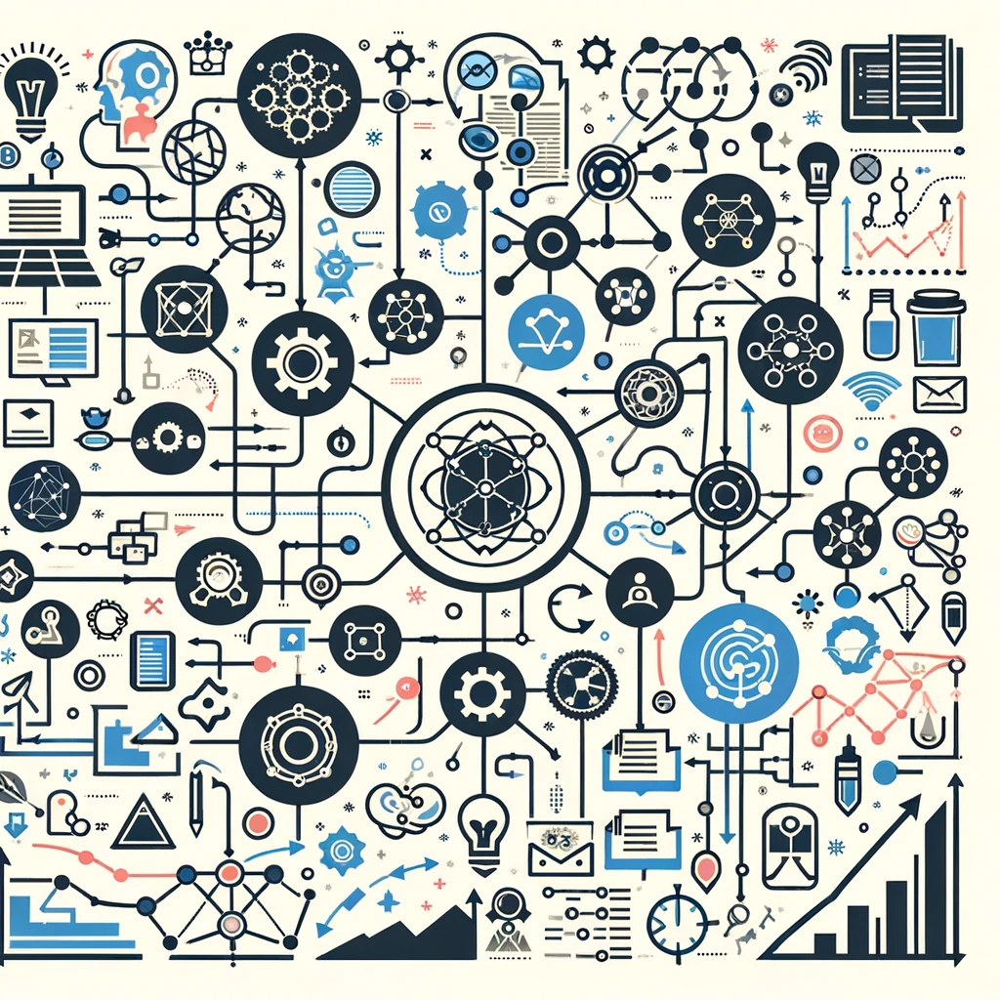

- [Systems Thinking](#systems-thinking)
  - [Definition](#definition)
    - [3 Basic System Rules:](#3-basic-system-rules)
    - [Summary](#summary)
  - [System Components:](#system-components)
  - [CLASSIFICATION](#classification)
  - [Business Systems](#business-systems)
    - [UTILITY](#utility)
    - [Examples](#examples)
    - [Organization](#organization)
      - [Operational Systems](#operational-systems)
      - [Managerial Systems](#managerial-systems)
      - [Strategic Systems](#strategic-systems)
      - [Support Systems](#support-systems)
      - [System Management](#system-management)
  - [Corpus](#corpus)
    - [Thinking in Systems: A Primer](#thinking-in-systems-a-primer)
    - [Systemantics: How Systems Work and Especially How They Fail](#systemantics-how-systems-work-and-especially-how-they-fail)
    - [The Fifth Discipline](#the-fifth-discipline)
  - [Bibliography](#bibliography)
    - [Books](#books)
    - [Research Papers](#research-papers)
    - [Online Journals and Databases](#online-journals-and-databases)

# Systems Thinking

## Definition 

A system is a collection components that work together to achieve a common goal. 

### 3 Basic System Rules: 

1. **Elements:** 🧩
   - The basic building blocks or components of a system. 
   - In a business context, elements can include employees, products, customers, technology, and policies.
   - Each element has distinct properties and roles within the system.

2. **Connections:** 🔗
   - The relationships or interactions between the elements.
   - These can be physical flows (like the movement of goods), informational (like communication), or relational (like reporting structures in an organization).
   - Connections determine how elements influence one another and are crucial for the functioning of the system.

3. **Feedback Loops:** 🔁
   - Mechanisms that allow the system to receive and respond to information, thereby self-regulating.
   - Two types: Positive feedback loops (which amplify or increase change) and negative feedback loops (which reduce or dampen change).
   - In business, feedback loops are essential for adaptation and improvement, such as customer feedback influencing product development.

Understanding these components is key to grasping how systems operate and evolve, particularly in complex environments like organizations. They provide insight into why systems behave as they do and how interventions might alter outcomes.

---

### Summary

**Definition and Scope:**
- 🤔 Systems thinking is a holistic approach focusing on how parts of a system interrelate and how systems evolve over time within larger systems.
- 🌟 Applicable in business, environment, engineering, social sciences, and more.

**Key Principles:**
1. **🔗 Interconnectedness:** Systems consist of interconnected components with complex interactions.
2. **🌍 Holism:** Emphasizes the entire system rather than just its parts.
3. **🔄 Feedback Loops:** Systems have stabilizing (negative) and growth/decline (positive) feedback loops.
4. **🎲 Causality:** Involves understanding non-linear and subtle causal relationships within systems.
5. **🦋 Emergence:** New properties or behaviors emerge from complex systems that are not evident from the components alone.

**Applications:**
- 💼 In business: For strategic planning, problem-solving, and organizational change.
- 🌱 In environmental science: To understand ecosystems and address climate change and sustainability.
- 🧑‍🤝‍🧑 In social sciences: To analyze societal issues and public policy.

**Benefits:**
- 👓 Provides a framework for seeing interrelationships and processes of change.
- 🔍 Helps in identifying leverage points where small changes can lead to significant improvements.

**Challenges:**
- 🔄 Requires shifting from linear to dynamic, holistic thinking.
- 🤯 The complexity of systems can make it difficult to identify all interactions and feedback loops.

**Conclusion:**
- 🌟 Systems thinking is crucial in our interconnected world, enabling deeper understanding and management of complex systems across various fields.

---

## System Components:

1. **Input**: Inputs are the resources, information, or energy that are required for the system to function. These inputs can come from both internal and external sources.

2. **Process**: Processes refer to the activities or operations that transform the inputs into desired outputs. These processes can be physical, chemical, biological, or social in nature, depending on the type of system.

3. **Output**: Outputs are the results or outcomes produced by the system. They can be tangible products, services, or intangible outcomes such as knowledge, information, or behavior changes.

4. **Feedback**: Feedback is the information or signals that are generated as a result of the system's outputs. It helps the system to monitor and adjust its performance, ensuring that it stays on track and achieves its goals.

5. **Environment**: The environment refers to the external context in which the system operates. It includes the physical, social, economic, and cultural factors that can influence or be influenced by the system.

6. **Boundaries**: Boundaries define the scope or limits of the system. They determine what is included within the system and what is excluded. Boundaries can be physical, conceptual, or organizational in nature.

7. **Interconnections**: Interconnections represent the relationships and interactions between the components of the system. They can be hierarchical, sequential, circular, or feedback loops, and they determine how the components influence and depend on each other.

8. **Purpose**: Purpose refers to the overall goal or objective of the system. It provides direction and guides the behavior and decision-making within the system.

9. **Emergence**: Emergence is the phenomenon where the system produces outcomes or properties that are not directly predictable from the individual components. It arises from the interactions and relationships between the components, leading to new patterns, behaviors, or properties.

10. **Hierarchy**: Hierarchy refers to the levels or layers of organization within the system. It represents the nested structure of subsystems and their relationships to the larger system.

These components are interconnected and interdependent, forming a complex system that can exhibit non-linear behavior and dynamics. Understanding and analyzing these components is essential for effective systems thinking and problem-solving.

## CLASSIFICATION

1. **Simple Systems:**
   - Consist of a few elements with simple interactions.
   - Example: A mechanical clock.

2. **Moderately Complex Systems:**
   - Have more elements than simple systems, with somewhat complex interactions.
   - Example: A small business organization.

3. **Complex Systems:**
   - Contain a large number of elements with intricate and often non-linear interactions.
   - Example: A national economy or an ecosystem.

4. **Highly Complex Systems:**
   - Characterized by an extremely large number of elements and interactions, which are often dynamic and change over time.
   - Example: Global climate systems or large-scale social networks.

5. **Ultra-Complex Systems:**
   - These systems are so complex that their behavior is often unpredictable and not fully understandable. They may include emergent properties and self-organization.
   - Example: Human brain or the internet as a whole.

Each category reflects an increase in complexity, not just in terms of the number of elements, but also in the complexity of interactions and the unpredictability of the system's behavior.

## Business Systems

In systems theory, a standard small organization can be categorized and understood as a complex system with various interrelated components. Here's how such an organization might be broken down:

1. **Structural Elements (Subsystems):**
   - **Leadership/Management:** The guiding force of the organization, often including a CEO or owner, and possibly a small team of managers or supervisors.
   - **Sales and Marketing:** Responsible for market analysis, customer engagement, product promotion, and sales.
   - **Operations/Production:** Focuses on the delivery of services or production of goods.
   - **Finance and Accounting:** Manages the organization's financial transactions, budgeting, and financial planning.
   - **Human Resources:** Handles recruitment, staff welfare, training, and regulatory compliance.
   - **Administration:** Provides support services like clerical work, scheduling, and office management.

2. **Processes:**
   - These are the methods and sequences of actions through which the organization transforms inputs (resources, labor, capital) into outputs (products or services).

3. **Interconnections:**
   - The communication and workflow channels that link the various subsystems. For example, information flow from Sales to Production for order fulfillment, or from HR to all departments for personnel management.

4. **Environment:**
   - External factors impacting the organization, such as market trends, competition, regulations, and economic conditions.

5. **Feedback Loops:**
   - Mechanisms for gathering information about the organization's performance and market response, and using this data to refine strategies and operations. For instance, customer feedback influencing product development.

6. **Goals and Strategy:**
   - The overarching objectives of the organization and the strategic approach to achieve these goals.

7. **Culture and Values:**
   - The emergent properties of the organization, including the workplace culture and core values, shaped by leadership style, employee interactions, and organizational practices.

8. **Adaptation and Learning:**
   - The capacity of the organization to learn from experiences, adapt to changes in the environment, and evolve its practices and strategies over time.

In systems theory, a organization is viewed not just as a collection of discrete parts, but as a cohesive entity where each component interacts with and influences the others, and where the whole is greater than the sum of its parts. This perspective helps in understanding the complexities and dynamics of organizational life and in devising more effective management and operational strategies.

### UTILITY

Applying systems thinking to a small business can provide several critical insights and benefits. Here are some key aspects to consider:

1. **Understanding Complexity and Interdependence:**
   - 🧩 In a small business, systems thinking helps you understand how different parts of your business (like sales, operations, marketing) are interconnected. Changes in one area can significantly impact others.

2. **Strategic Decision Making:**
   - 🎯 Systems thinking aids in making more informed decisions by considering the broader implications of actions. This is especially important in a small business where resources are often limited, and decisions can have a substantial impact.

3. **Problem-Solving:**
   - 🔍 Instead of tackling problems in isolation, systems thinking encourages looking at the bigger picture. This approach helps identify root causes of issues, leading to more effective and sustainable solutions.

4. **Adaptability and Resilience:**
   - 🌱 Small businesses can use systems thinking to become more adaptable and resilient, particularly in dynamic markets. Understanding system dynamics enables businesses to anticipate and adapt to changes more effectively.

5. **Innovation and Growth:**
   - 💡 By understanding the system as a whole, small businesses can identify new opportunities for innovation and growth that might not be apparent when focusing on individual parts of the business.

6. **Customer and Market Understanding:**
   - 📊 Systems thinking helps in understanding the broader market and customer ecosystem, leading to better customer engagement strategies and market positioning.

7. **Resource Management:**
   - 💼 Efficient resource management is crucial in small businesses. Systems thinking provides a framework for evaluating how resources are allocated and utilized across different parts of the business.

8. **Employee Engagement and Team Dynamics:**
   - 👥 It also plays a role in managing team dynamics and ensuring that employees are engaged and working effectively towards the organization's goals.

9. **Feedback Loops and Continuous Improvement:**
   - 🔁 Establishing effective feedback loops is a key principle in systems thinking, which is vital for continuous improvement in processes, products, and customer service.

10. **Sustainability:**
    - 🌍 Lastly, systems thinking encourages businesses to consider their long-term impact on the environment and society, leading to more sustainable business practices.

### Examples 

🤔 **Curious Systems in Small Business**
- Innovative Product Development: 🚀 Small businesses often need to be highly innovative to compete, developing unique products or services that stand out in the market.
- Flexible Work Arrangements: 💼 Embracing remote work or flexible schedules, which is quite different from traditional 9-to-5 jobs.
- Utilizing Social Media for Marketing: 🔗 Leveraging platforms like Instagram or Twitter for marketing, a relatively new and dynamic way to reach customers compared to traditional advertising.
⚡ **Extreme Systems in a Small Business**
- Rapid Scaling Strategies: ⚡️ Strategies to quickly expand the business, like aggressive online marketing or franchising, which can be high-risk but high-reward.
- Handling Market Volatility: 🆘 Small businesses often operate in niche markets which can be highly volatile, requiring robust crisis management skills.
- Targeting Niche Customer Segments: 🎯 Focusing on very specific customer groups with unique needs, which demands highly specialized products or services.
🔄 **Opposite Systems in a Small Business**
- DIY vs. Outsourced Services: 🔄 Deciding between handling tasks like accounting or marketing in-house or outsourcing them to specialized firms.
- Online Store vs. Brick-and-Mortar: 🏬 vs. 💻 Some small businesses operate exclusively online, while others rely on physical storefronts, or a hybrid of both.
- Direct Sales vs. Partnership Channels: 👥 Choosing between selling directly to customers or using intermediaries like distributors or retail partners.

### Organization

Classifying the systems of a small-sized company involves breaking down the various operational, managerial, and strategic components that drive the business. Here's an overview:

#### Operational Systems

1. **Product or Service Delivery System:** 📦
   - How the company produces and delivers its products or services to customers.
2. **Supply Chain and Logistics System:** 🚚
   - Manages the flow of goods from suppliers to the business and then to the customers.
3. **Customer Support and Service System:** 🤝
   - Handles customer inquiries, complaints, and after-sales service.

#### Managerial Systems

4. **Human Resources Management System:** 👥
   - Manages hiring, training, employee relations, and payroll.
5. **Financial Management System:** 💰
   - Deals with budgeting, accounting, financial reporting, and investment management.
6. **Quality Control System:** 🔍
   - Ensures that products or services meet certain quality standards.

#### Strategic Systems

7. **Marketing and Sales System:** 📈
   - Responsible for market research, advertising, sales strategies, and customer relationship management.
8. **Business Intelligence System:** 💡
   - Collects and processes data to support better business decision-making.
9. **Innovation and Development System:** 🚀
   - Focuses on research and development for new products or services and improving existing ones.

#### Support Systems

10. **IT and Technical Support System:** 💻
   - Manages the company's technology infrastructure, including hardware, software, and data security.
11. **Administrative and Office Management System:** 📋
   - Handles day-to-day administrative tasks, office supplies, and facilities management.
12. **Legal and Compliance System:** ⚖️
   - Ensures the business complies with laws and regulations.

Each system plays a crucial role in the smooth operation and growth of a small-sized company. They are interdependent, meaning changes or issues in one system can impact others. Understanding and effectively managing these systems is key to the success and sustainability of the business. 🌐

#### System Management

Working effectively with systems in a company requires a blend of strategic thinking, adaptability, and a good understanding of how different parts of the organization interact. Here are some tips and tricks for navigating and optimizing systems in a business setting:

 Understand the Big Picture
1. **Map the Systems:** 🗺️ Visualize how different systems interact. Flowcharts or system diagrams can be helpful.
2. **Identify Interdependencies:** 🔗 Recognize how changes in one part of the system might affect others.

Foster Effective Communication
3. **Promote Transparency:** 📢 Encourage open communication about how decisions are made and how systems operate.
4. **Regular Feedback:** 🔁 Establish channels for regular feedback from all levels of the organization.

Embrace Adaptability and Continuous Learning
5. **Be Open to Change:** 🌱 Stay flexible and open to adjusting systems as the business environment evolves.
6. **Encourage Experimentation:** 💡 Create a safe space for trial and error to foster innovation within systems.

 Focus on Quality and Efficiency
7. **Implement Quality Controls:** 🔍 Regularly review and refine processes to maintain high standards.
8. **Streamline Processes:** 🚀 Continuously look for ways to make systems more efficient and less complex.

Utilize Technology and Tools
9. **Leverage Technology:** 💻 Use software and tools that can automate and enhance system efficiency.
10. **Data-Driven Decisions:** 📊 Make use of analytics and data to inform decisions about system improvements.

11. **Human-Centric Approach:** 👥 Remember that systems are run by people. Prioritizing employee well-being and development is crucial.
12. **Collaborative Culture:** 🤝 Foster a culture of collaboration where employees feel valued and part of the system.

Stay Aligned with Business Goals
13. **Align with Objectives:** 🎯 Ensure all systems and processes align with the overall business goals and strategy.
14. **Review and Adjust:** 🔄 Regularly revisit systems to ensure they stay relevant and aligned with business needs.

Balance Standardization and Flexibility
15. **Standardize Where Possible:** 📏 Implement standard procedures for efficiency but remain flexible to adapt where needed.

Practice Risk Management
16. **Identify Risks:** ⚠️ Be proactive in identifying potential risks within systems and plan accordingly.

Foster a Learning Organization
17. **Continuous Improvement:** 📈 Adopt a mindset of continuous improvement and learning within all systems.

By applying these tips, you can effectively work with and improve the systems within a company, leading to better overall performance, employee satisfaction, and customer experience. Remember, systems thinking is not just about the processes but also about the people and the dynamic interactions within the organization. 🌐
___

## Corpus

1. **"Thinking in Systems: A Primer" by Donella H. Meadows**
   - This book is a great starting point for anyone new to systems thinking. Meadows, a pioneering environmental scientist, explains key concepts in a clear and accessible way.

2. **"The Fifth Discipline: The Art and Practice of the Learning Organization" by Peter M. Senge**
   - Senge's work is crucial in the field of systems thinking, particularly in its application to organizational development and learning. This book introduces the concept of a "learning organization" and how systems thinking is integral to it.

3. **"Systemantics: How Systems Work and Especially How They Fail" by John Gall**
   - A slightly more humorous take on systems, Gall's book offers insightful, if somewhat cynical, observations on why systems often don’t work as intended. It's an entertaining read that offers real wisdom.

4. **"An Introduction to General Systems Thinking" by Gerald M. Weinberg**
   - Weinberg's book is a classic in the field, providing a thorough overview of general systems thinking principles. It's particularly recommended for those interested in software development and IT.

5. **"Complex Adaptive Systems: An Introduction to Computational Models of Social Life" by John H. Miller and Scott E. Page**
   - For those interested in the intersection of systems thinking and social sciences, this book offers an introduction to the concept of complex adaptive systems.

6. **"Systems Thinking For Social Change: A Practical Guide to Solving Complex Problems, Avoiding Unintended Consequences, and Achieving Lasting Results" by David Peter Stroh**
   - This book focuses on applying systems thinking to social and environmental issues, offering practical strategies for enacting meaningful change.

These books provide a mix of foundational theories, practical applications, and diverse perspectives, making them valuable resources for anyone looking to deepen their understanding of systems thinking.

### Thinking in Systems: A Primer

"Thinking in Systems: A Primer" is a book by Donella H. Meadows, published posthumously in 2008. It serves as an accessible and comprehensive introduction to the concept of systems thinking. Here's more detailed information about the book and its author:

1. **Author Background:**
   - Donella H. Meadows was an influential environmental scientist, teacher, and writer, well-known for her work in sustainability and systems analysis.
   - She was a lead author of the influential environmental book "The Limits to Growth," which was one of the first studies to model the consequences of unrestricted economic and population growth on the planet.

2. **Book Overview:**
   - "Thinking in Systems: A Primer" is designed as an introductory text for those new to the concept of systems thinking.
   - The book explains how systems (sets of interacting or interdependent components forming an integrated whole) work, how they are structured, and how understanding these systems is crucial to solving complex problems.

3. **Key Themes:**
   - Meadows covers essential concepts such as feedback loops, resilience, self-organization, and system traps.
   - She explains how systems thinking can be applied to various real-world issues, including environmental challenges, economic policies, and organizational management.

4. **Style and Approach:**
   - The book is known for its clarity and simplicity, making the often complex topic of systems thinking accessible to a broad audience.
   - Meadows uses real-world examples to illustrate key points, helping readers understand how systems operate in everyday contexts.

5. **Impact and Legacy:**
   - Despite its posthumous publication, the book has had a significant impact, becoming a foundational text in systems thinking and sustainability education.
   - Meadows' work continues to influence educators, policymakers, and business leaders in how they approach and solve complex problems.

"Thinking in Systems: A Primer" is celebrated for its ability to distill intricate systems concepts into understandable and practical insights. It's a recommended read for anyone looking to gain a deeper understanding of how systems function and how this understanding can be applied to various domains.

### Systemantics: How Systems Work and Especially How They Fail

"Systemantics: How Systems Work and Especially How They Fail" is written by John Gall, an American author and pediatrician. Here's more information about him:

1. **Professional Background:**
   - John Gall was primarily a pediatrician by profession. However, he gained recognition outside of medicine as an author, particularly for his work in systems theory.

2. **The Book - Systemantics:**
   - Initially published in the 1970s, "Systemantics" (later editions titled "The Systems Bible") is Gall's most famous work. The book presents a satirical and somewhat cynical view of systems theory.
   - In this book, Gall explores how and why systems, particularly complex ones, often fail. He uses a humorous and accessible approach to discuss the inherent flaws and unpredictable nature of systems.

3. **Key Contributions:**
   - One of Gall's most notable contributions is the formulation of "Gall's Law," a rule related to systems design that suggests complex systems evolve from simpler systems that work, rather than being built from scratch.
   - His work is known for its contrarian and insightful views on the nature of systems, often challenging the conventional wisdom of the time.

4. **Influence:**
   - While not as widely cited in academic texts as some other systems theorists, Gall's work has a cult following and is often referenced in discussions about organizational behavior, software development, and systems design.
   - His ideas have influenced thinkers and practitioners who deal with complex systems, particularly in understanding the limitations and pitfalls of system design and implementation.

5. **Writing Style:**
   - Gall's writing is known for its wit and accessibility, making complex ideas about systems understandable and engaging for a broad audience.

Despite his primarily medical background, John Gall's contributions through "Systemantics" have had a lasting impact on the field of systems theory, particularly in how people think about the functionality and dysfunctionality of complex systems. His insights continue to be relevant in various fields, including business, technology, and organizational development.

### The Fifth Discipline

"The Fifth Discipline"  Introduces the concept of a "learning organization." This is an organization that facilitates the learning of its members and continuously transforms itself to better adapt and thrive in a rapidly changing environment.

The Five Disciplines:
The book revolves around five key disciplines that are crucial for creating a learning organization:

**Systems Thinking**: 
The cornerstone of the five disciplines. It involves understanding the organization as a complex system composed of interrelated parts. It emphasizes looking at the whole, rather than just the parts, to understand the underlying patterns and leverage points for change.

**Personal Mastery:** 

This discipline focuses on individual learning and growth. It's about clarifying and deepening personal vision, focusing energy, and seeing reality objectively. It requires continuous self-reflection and personal development.

**Mental Models:** 

These are deeply ingrained assumptions and generalizations that influence how we understand the world and how we take action. Challenging and improving these mental models is crucial for learning and innovation.

**Building Shared Vision:** 

This involves fostering a shared picture of the future that the organization seeks to create. A compelling shared vision inspires, motivates, and guides members toward collective goals.

Team Learning: This discipline focuses on facilitating learning within teams. It involves dialogue and discussion, where team members learn to suspend assumptions and engage in genuine 'thinking together'.

**Key Messages:**

Interconnectedness: The book emphasizes the interconnectedness of problems and solutions, encouraging holistic thinking.
Learning as a Continuous Process: Learning is not a one-time event but a continuous cycle of adaptation and change.
Importance of Dialogue: Open and honest communication is vital for learning and adapting.

Leadership Role: Leaders in learning organizations are designers, stewards, and teachers who nurture and facilitate the growth of the organization.

Impact on Organizations: The book has profoundly influenced how organizations view change and development. It advocates for a shift from traditional command-and-control management styles to more collaborative and adaptive approaches. It provides tools and strategies for organizations to develop resilience, adaptability, and innovation.

Conclusion:
"The Fifth Discipline" is not just a set of tools and techniques but a new way of thinking about organizations. It's about building organizations where people continually expand their capabilities to shape their future – an essential skill in an ever-changing world.

This book has become essential reading for leaders and managers seeking to create sustainable and dynamic organizations.
___

## Bibliography

### Books
1. "Thinking in Systems: A Primer" by Donella H. Meadows (2008)
2. "The Fifth Discipline: The Art and Practice of the Learning Organization" by Peter M. Senge (1990)
3. "Systemantics: How Systems Work and Especially How They Fail" by John Gall (1975)
4. "An Introduction to General Systems Thinking" by Gerald M. Weinberg (1975)
5. "Complex Adaptive Systems: An Introduction to Computational Models of Social Life" by John H. Miller and Scott E. Page (2007)
6. "Systems Thinking For Social Change: A Practical Guide to Solving Complex Problems, Avoiding Unintended 7. Consequences, and Achieving Lasting Results" by David Peter Stroh (2015)
7. "The Systems View of Life: A Unifying Vision" by Fritjof Capra and Pier Luigi Luisi (2014)

### Research Papers

Research papers often depend on the specific aspect of systems thinking you're interested in. Here are a few seminal papers across various domains:

1. **"General System Theory: Foundations, Development, Applications" by Ludwig von Bertalanffy (1968)**
2. **"Principles of Systems" by Jay W. Forrester (1968)**
3. **"Leverage Points: Places to Intervene in a System" by Donella Meadows (1999)**
4. **"Management: A Systems Approach" by Stafford Beer (1967) in the journal Management Science**
5. **"System Dynamics Modeling for Project Management" by John D. Sterman (2000)**
6. **"A Complexity Approach to Sustainability – Theory and Application" by Angela Espinosa and Jon Walker (2011)**
7. **"Systems Thinking, Systems Practice" by Peter Checkland (1981)**

### Online Journals and Databases
For a more exhaustive list of research papers, consider exploring academic journals and databases such as:

- **System Dynamics Review**
- **Journal of the Operational Research Society**
- **Systems Research and Behavioral Science**
- **International Journal of General Systems**

These journals regularly publish research in the field of systems thinking and its applications in various domains. Remember, accessing some of these papers may require academic or institutional subscriptions.

___

> Source: ChatGPT 4.0, January 2024
